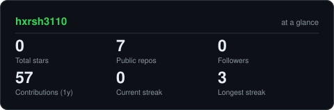
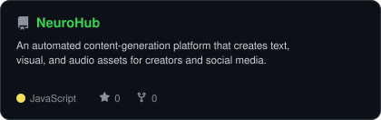

<div align="center">

<!-- PORTRAIT - generated by scripts/dotify.py from assets/jacket.png.
     Colour mode, so one file serves both GitHub themes. Regenerate with:
       python scripts/dotify.py assets/jacket.png -o assets/portrait \
         --cols 100 --equalize --detail 0.5 --color -->


<br>

<!-- NAME / TAGLINE - animated typing -->
<a href="https://github.com/hxrsh3110">
  
</a>

<br>

<!-- SOCIALS -->
<a href="https://linkedin.com/in/harsh-bankar"></a>
<a href="mailto:harshbankar31@gmail.com"></a>
<!-- <a href="https://dossier-iota-one.vercel.app"></a> -->
<!-- <a href="https://codeforces.com/profile/gargibhardwaj24"></a> -->
<!-- <a href="https://leetcode.com/u/gargibhardwaj24"></a> -->


</div>

---

## `~/` whoami

```console
$ cat about.txt
```

Hi, I'm **Harsh Bankar**. I'm currently diving deep into cloud infrastructure and DevOps, figuring out how to build resilient systems and streamline the path from code to production.

- Currently building **[Cloud Deployed Threat Sensor](https://github.com/hxrsh3110/Cloud-Deployed-Threat-Intelligence-Sensor.git)** 
<!-- and **[Spyder](https://github.com/hxrsh3110/spyder_frontend)** -->
<!-- - Portfolio: **[dossier-iota-one.vercel.app](https://dossier-iota-one.vercel.app)** -->
- Learning **DevOps + Cloud Infrastructure**
- Fun fact: **I shifted toward cloud and infrastructure because writing code is only half the fun; making sure it stays up when everything goes sideways is the real challenge.**

<br>

<div align="center">

## `~/` toolbox


</div>

---

<div align="center">

## `~/` skill radar

<table>
<tr>
<td width="50%" align="center" valign="middle">

<!-- Self-rated radar - edit assets/skills.json, the workflow redraws it -->
<picture>
  <source media="(prefers-color-scheme: dark)"  srcset="assets/radar-dark.svg">
  <source media="(prefers-color-scheme: light)" srcset="assets/radar-light.svg">
  
</picture>

</td>
<td width="50%" align="center" valign="middle">

<!-- Live radar built from real language byte counts across your repos -->
<picture>
  <source media="(prefers-color-scheme: dark)"  srcset="assets/radar-langs-dark.svg">
  <source media="(prefers-color-scheme: light)" srcset="assets/radar-langs-light.svg">
  
</picture>

</td>
</tr>
</table>

</div>

---

<div align="center">

## `~/` contribution calendar

<!-- 3D isometric calendar, regenerated every 6h by .github/workflows/metrics.yml -->


<br><br>

<!-- Snake eats the contribution graph - .github/workflows/snake.yml -->
<picture>
  <source media="(prefers-color-scheme: dark)"  srcset="https://raw.githubusercontent.com/hxrsh3110/hxrsh3110/output/snake-dark.svg">
  <source media="(prefers-color-scheme: light)" srcset="https://raw.githubusercontent.com/hxrsh3110/hxrsh3110/output/snake.svg">
  
</picture>

</div>

---

<div align="center">

## `~/` the numbers

<!-- Generated by scripts/cards.py into this repo. Deliberately NOT
     github-readme-stats / streak-stats / github-profile-trophy: those are
     shared public instances that go down and take the whole section with them. -->
<picture>
  <source media="(prefers-color-scheme: dark)"  srcset="assets/card-stats-dark.svg">
  <source media="(prefers-color-scheme: light)" srcset="assets/card-stats-light.svg">
  
</picture>

<br>


<br><br>


</div>

---

<div align="center">

## `~/` selected work

<!-- Cards generated by scripts/cards.py from assets/projects.json.
     Stars, forks and language are pulled live from the API on every run. -->
<table>
<tr>
<td width="50%">
  <a href="https://github.com/hxrsh3110/Cloud-Deployed-Threat-Intelligence-Sensor.git">
    <picture>
      <source media="(prefers-color-scheme: dark)"  srcset="assets/card-honeypot-dark.svg">
      <source media="(prefers-color-scheme: light)" srcset="assets/card-honeypot-light.svg">
      
    </picture>
  </a>
</td>
<td width="50%">
  <a href="https://github.com/hxrsh3110/Reconnaissance-Tool">
    <picture>
      <source media="(prefers-color-scheme: dark)"  srcset="assets/card-recon-dark.svg">
      <source media="(prefers-color-scheme: light)" srcset="assets/card-recon-light.svg">
      
    </picture>
  </a>
</td>
</tr>
<tr>
<td width="50%">
  <a href="https://github.com/hxrsh3110/NeuroHub">
    <picture>
      <source media="(prefers-color-scheme: dark)"  srcset="assets/card-NeuroHub-dark.svg">
      <source media="(prefers-color-scheme: light)" srcset="assets/card-NeuroHub-light.svg">
      
    </picture>
  </a>
</td>
<!-- <td width="50%">
  <a href="https://github.com/gargibhardwaj24/humanOS">
    <picture>
      <source media="(prefers-color-scheme: dark)"  srcset="assets/card-humanOS-dark.svg">
      <source media="(prefers-color-scheme: light)" srcset="assets/card-humanOS-light.svg">
      
    </picture>
  </a>
</td> -->
</tr>
</table>

<!-- <sub>

| project | live | stack |
|---|---|---|
| **[dossier](https://github.com/gargibhardwaj24/dossier)** | [dossier-iota-one.vercel.app](https://dossier-iota-one.vercel.app) | `JavaScript` `GSAP` `Lenis` |
| **[Sage](https://github.com/gargibhardwaj24/Sage)** | [sage-calendar.vercel.app](https://sage-calendar.vercel.app) | `JavaScript` |
| **[Socrates](https://github.com/gargibhardwaj24/Socrates)** | [socrates-one-coral.vercel.app](https://socrates-one-coral.vercel.app) | `Next.js` `Prisma` `TypeScript` |
| **[humanOS](https://github.com/gargibhardwaj24/humanOS)** | [human-os-two.vercel.app](https://human-os-two.vercel.app) | `JavaScript` `Gemini` |

</sub> -->

</div>

---

<div align="center">

<sub>`01110100 01101000 01100001 01101110 01101011 01110011 00100000 01100110 01101111 01110010 00100000 01110011 01100011 01110010 01101111 01101100 01101100 01101001 01101110 01100111`</sub>

</div>
